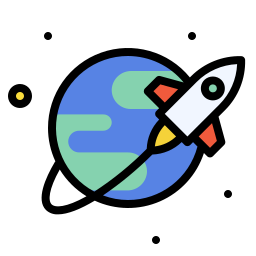

  <p align="center">
   
  </p>
   <br>
<div align="center">
  <h2><b>Space-Travelers-Hub</b></h2>
  <h4>Ivan Gonzalez & Karim Barragan</h4> 
</div>
<br>

# 📗 Table of Contents

- [📖 About the Project](#about-project) 
  - [🛠 Built With](#built-with)
    - [Tech Stack](#tech-stack)
    - [Key Features](#key-features)
- [💻 Getting Started](#getting-started)
  - [Setup](#setup)
  - [Prerequisites](#prerequisites)
  - [Install](#install)
  - [Usage](#usage)
- [👥 Authors](#authors)
- [🛩️ Future Features](#future-features)
- [🤝 Contributing](#contributing)
- [⭐️ Show your support](#support)
- [🙏 Acknowledgements](#acknowledgements)
- [📝 License](#license)

# 📖 Space-Travelers-Hub <a name="about-project"></a>

**Space-Travelers-Hub** is a web app that allows users to book rockets and join space missions.

## 🛠 Built With <a name="built-with"></a>

1. React
2. React-Bootstrap
3. Jest
4. React-Redux

### Tech Stack <a name="tech-stack"></a>

In this project we use React to build a space travelers' hub web app.
<details>
  <summary>Client</summary>
  <ul>
    <li><a href="https://es.react.dev/">React</a></li>
    <li><a href="https://react-bootstrap.github.io/">React-Bootstrap</a></li>
    <li><a href="https://jestjs.io/">Jest</a></li>
    <li><a href="https://react-redux.js.org/">React-Redux</a></li>
  </ul>
</details>

### Key Features <a name="key-features"></a>

- Reserve and cancel rockets for missions.
- Join and leave missions.
- Dashboard with rockets reserved and missions joined.

<p align="right">(<a href="#readme-top">back to top</a>)</p>


# Getting Started <a name="getting-started"></a>

In this project it is used React to build a space travelers' hub web app.

### Setup

To get a local copy, follow these steps.

Clone this repository to your desired folder:

  ```sh
  cd my-folder
  git clone https://github.com/ivangonzalez224/Space-Travelers-Hub.git
  code . (To open in Vscode)
```

### Prerequisites

In order to run this project you need:

1. Git.
2. Visual Studio Code or another code editor.
3. Browser.  
  
  
### Install

This project does not require installation. Just clone the repository to your local machine.
Even though, for general purposes, Install this project with:
```sh
  cd my-folder
  npm install
```

### Usage

To run the project, do the following:
- Run `npm start` to open the project in your browser.

<p align="right">(<a href="#readme-top">back to top</a>)</p>

## 👥 Authors <a name="authors"></a>

👤 **Iván Gonzalez**

- GitHub: [@ivangonzalez224](https://github.com/ivangonzalez224)
- Twitter: [@ivang2204](https://twitter.com/ivang2204)
- LinkedIn: [LinkedIn](https://linkedin.com/in/iván-gonzalez-robles-957491275)

👤 **Karim Barragan**

- GitHub: [@Rebelzob](https://github.com/Rebelzob)
- LinkedIn: [Karim-Barragan](https://www.linkedin.com/in/karim-barragan/)


<p align="right">(<a href="#readme-top">back to top</a>)</p>

## 🛩️ Future Features <a name="future-features"></a>

- Add readmore button to missions.
- Add cancel mission button to missions.
- Add cancel rocket button to rockets.

<p align="right">(<a href="#readme-top">back to top</a>)</p>

## 🤝 Contributing <a name="contributing"></a>

Contributions, issues, and feature requests are welcome!

Feel free to check the [issues page](https://github.com/ivangonzalez224/Space-Travelers-Hub/issues).

<p align="right">(<a href="#readme-top">back to top</a>)</p>

## ⭐️ Show your support <a name="support"></a>

If you like this project give it a ⭐️.

<p align="right">(<a href="#readme-top">back to top</a>)</p>

## 🙏 Acknowledgments <a name="acknowledgements"></a>

I would like to thank Microverse for the oportunity given to me to work in this project.

<p align="right">(<a href="#readme-top">back to top</a>)</p>

## 📝 License <a name="license"></a>

This project is [MIT](./LICENSE) licensed.